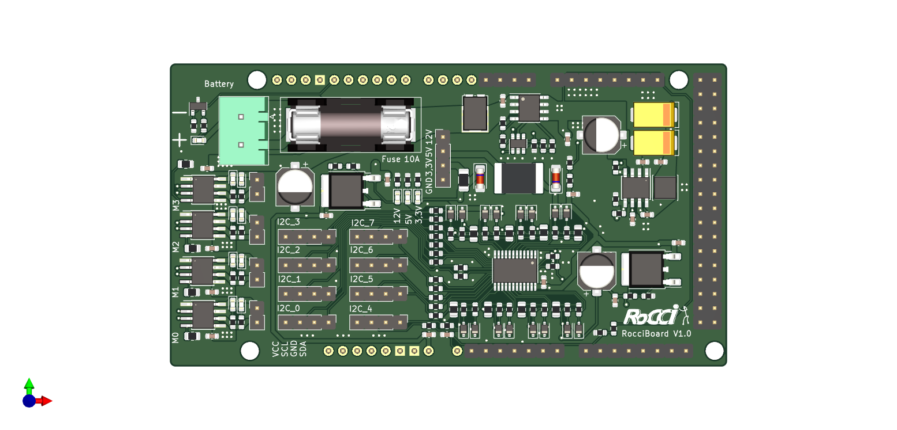
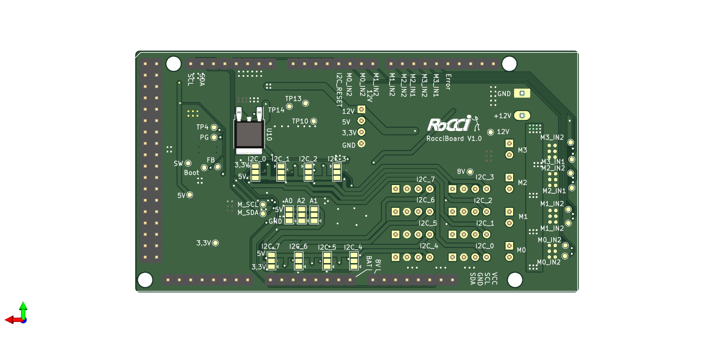

# Rocci Board

# Features

* 4x DC Motor outputs a 3 A (motor driver with current limitation)
* 8 separate i2c channels
* low voltage shutdown for battery protection
* i2c fully protected against 12V and reverse polarity
* 3 A switching regulator for 5 V
* 3,3 V with 1 A LDO
* 8 V for Arduino VIN pin
* reverse polarity protection on battery connector
* short circuit protection on all supply pins

# Schematic

[Schematic as pdf](documentation/RocciBoard.pdf)

[Layout as pdf](documentation/RocciBoard__Assembly.pdf)

# Pinout Diagram

## Top

## Bottom

